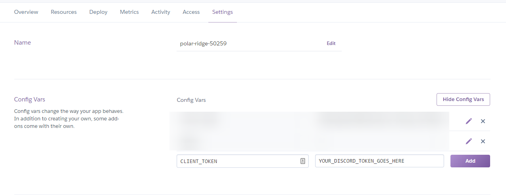

# Discord Bot

## Getting Started
If you'd like this bot, clone the repo, and create a .env file. Inside your .env file you will need your client token. For example 
`CLIENT_TOKEN = YOUR_DISCORD_TOKEN_GOES_HERE`

After you have set that up, the bot will run locally. If you'd like to host the bot elsewhere, you will need to set it up with whatever web service or host you choose.

## Auto Reactions
This is a simple bot built with DiscordJS and Javascript. When people send messages in discord, the bot will automatically respond with the custom emote specified. Currently it is custom set to react with KBT112. To change this, simply insert into line `emoji.name === "YOUR_EMOJI_NAME_HERE"` with your emoji name.

In order to react to specific users, add their discord id and name into user.json. Insert into the line  `user.name == "YOUR_USERNAME_HERE"` with who you would like the bot to auto respond to. To add more, just add `||` between usernames. 

## Hosting on Heroku
You will also need to set up your token on heroku as well. Inside settings, under `Config Vars`, you will need to do a similar process as you did with the .env file. View the image for an example.

In order for this bot to be kept active at all times, we must prevent the webpage from idling. To do this, we set up a simple interval to ping the website every 5 minutes. Otherwise, the bot will go offline after 30 minutes. However, you can host the bot locally as well, just run `node index.js`.